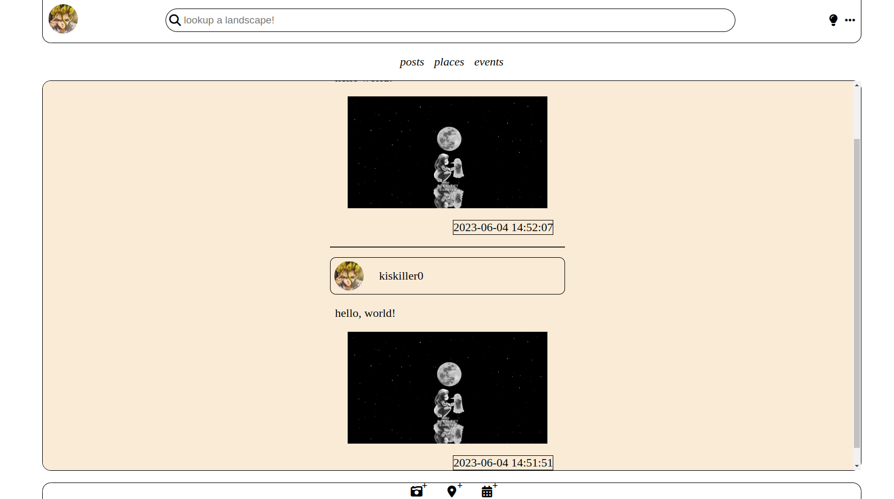
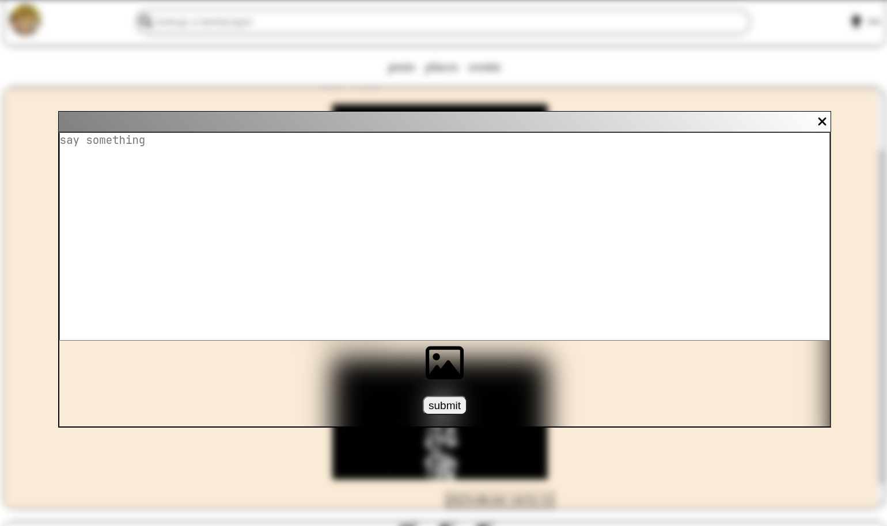

# landscape-marker

This is a simple CRUD application that allows you to upload posts with images, and comment on posts.
I have added two other kinds of posts (place, event) as this is supposed to be an application that promotes tourism.
but the commenting ability is still limited to posts of type "post".

pagination (according to my limited understanding) has been implemented, so you get 2 posts when you login, and then the
rest of the posts are fetched as you scroll down, this pagination behaviour is implemented for the three types of
posts (thanks to oop).

## presentation

## How to use:

1. execute the contents of the file models/db preparation.sql
2. copy the project files to your server-dir, it needs to be in the htdocs directly, as the main site of the server.

## TODO

[ ]- hash passwords

[ ]- make a helpers.php that you include in all api endpoints so that you avoid copy-pasting same code in the codebase

[ ]- look for a way to replace length document.createElement and appendChild statements as a way of rendering json to
the
ui, may be template engines.

[ ]- replace server-side rendering for the post and event views with client-side pagination based rendering like the one
used for fetching posts.

[ ]- comments should be implemented for events and places

[ ]- pagination and client-side rendering for comments as well

[ ]- you need a way to clean tmpprofiles folder after usage

[ ]- search is also server-rendered, and support for events and places needs to be added, most of this is because the
parent Table class doens't have a genereic method that uses "LIKE" in sql to fetch records.

[ ]- extend the Table to support search and complex queries